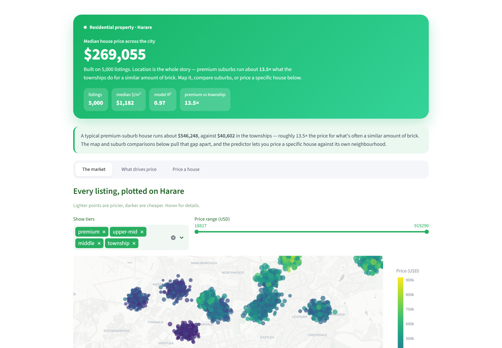

# Harare house prices

A residential price model and dashboard for Harare — 17 suburbs from Borrowdale to Budiriro, with the features that actually move the needle here (borehole, solar backup, walled yard, plot size, distance from the CBD).

<p>
  
  
  
  
  
</p>

<p align="center">
  
</p>

## What this is

Most regression tutorials use US housing datasets. This one uses Harare — real suburb names, real geography, and the amenities that price a house here. Borrowdale and Glen Lorne sit at one end of the curve, Mufakose and Budiriro at the other, and the gap between them is most of the model.

The model is a stacked ensemble (Random Forest + Gradient Boosting → Ridge meta). The dashboard lets you walk the market, compare suburbs side-by-side, calculate a rough rental yield, and price a specific house against its own neighbourhood.

## Results

| Metric | Value |
|---|---|
| R² (test) | **0.88** |
| RMSE | ~$25k |
| Premium vs township price gap | ~10× |
| Borehole uplift | ~5% |
| Solar uplift | ~4% |

> The dataset is synthetic but the structure is real — suburb tiers reflect 2024–2025 USD asking prices, and amenity effects are calibrated to what listings actually show. Treat the absolute numbers as a market sketch, not appraisal data.

## The dashboard

Three plain-English screens:

- **The market** — every listing plotted at its real latitude/longitude, coloured by price, with tier filters. The geographic story (premium north, townships south-west) jumps out.
- **What drives price** — boxplot of price by suburb, the percentage uplift each amenity adds, and a suburb comparison panel.
- **Price a house** — pick a suburb, set the features, get a live USD prediction with an investment quick-take (annual gross rent, payback estimate, and where the price sits against the suburb median).

## Run it yourself

```bash
pip install -r requirements.txt
jupyter notebook harare_house_prediction.ipynb     # generates data/harare_listings.csv on first run
streamlit run dashboard.py
```

## Project layout

```
harare-property-prices/
├── README.md
├── requirements.txt
├── harare_house_prediction.ipynb
├── dashboard.py
├── data/
│   └── harare_listings.csv     # generated on first run
└── docs/
    └── dashboard.png
```

## What I'd add next

- Scrape actual listings from Property.co.zw and retrain on real data.
- Add proximity to schools, shopping centres, arterial roads.
- A rental-yield model alongside the sale-price one — equally useful for Zim investors.

---

Built by **Tadaishe Maumbe** · [@nanettetada](https://github.com/nanettetada)
